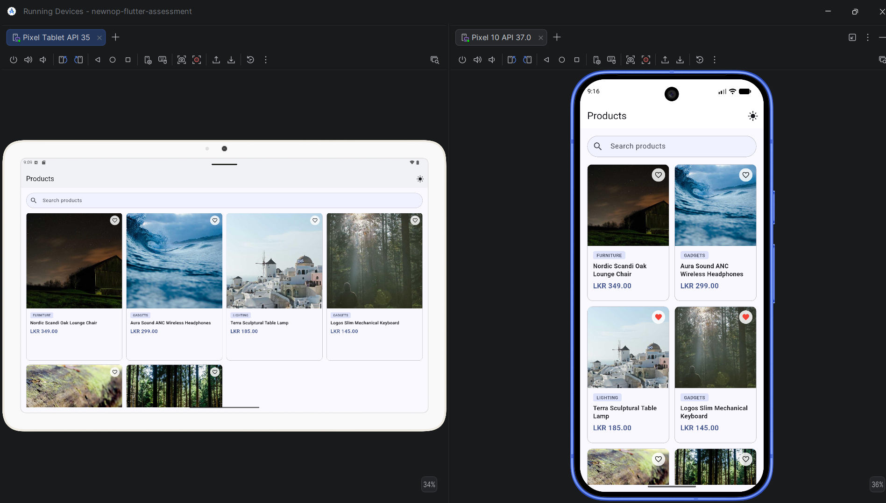
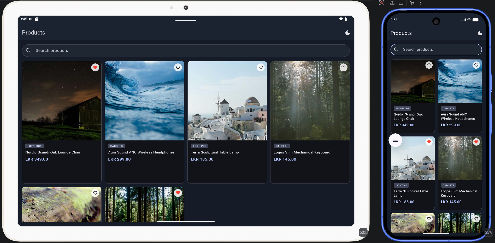
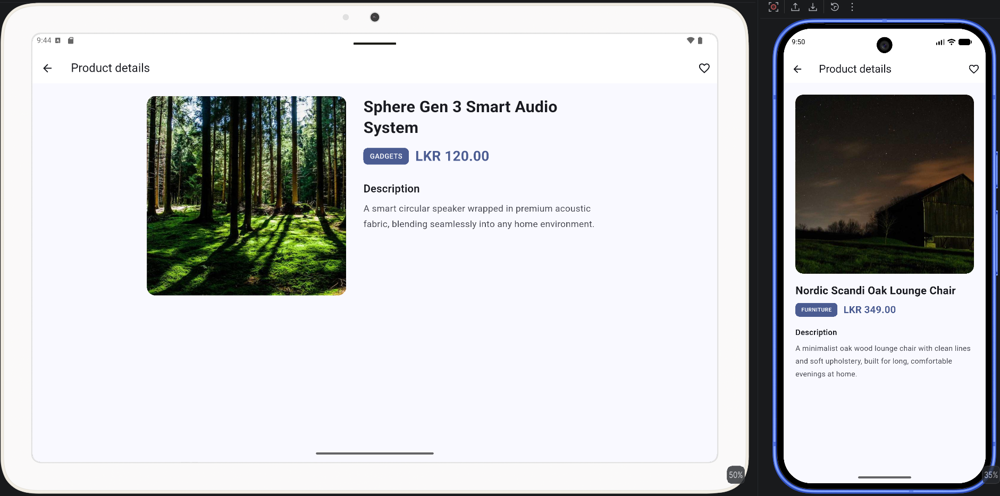
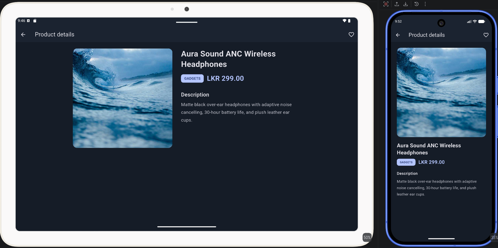
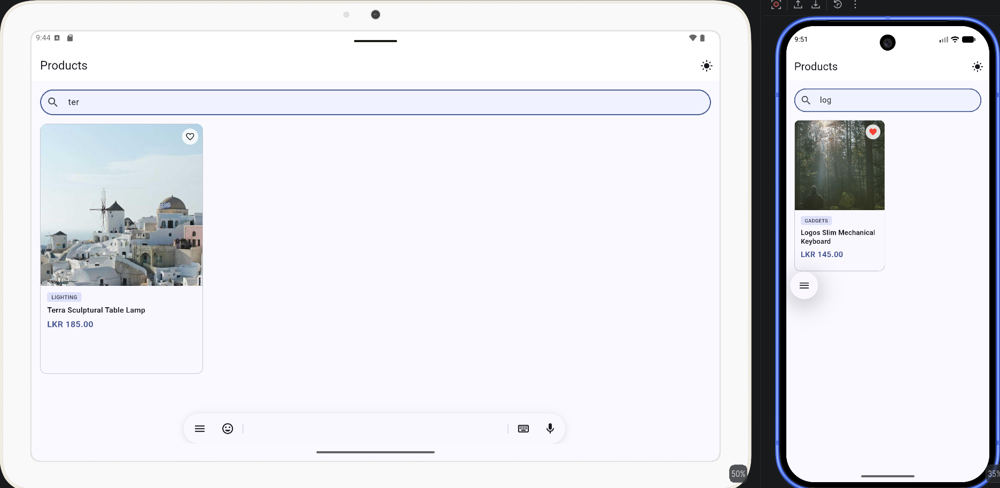

# Newnop Flutter Assessment — Product Catalogue

## Project Overview

A Flutter product catalogue app built for the Associate Flutter Developer
practical assessment. It displays a searchable, filterable grid of products,
lets users mark products as favourites (persisted across app restarts), and
supports both light and dark themes with a user-controlled toggle.

**Core features implemented:**
- Product List screen — grid of products with image, name, category, price, favourite toggle
- Product Details screen — full description, larger image, favourite toggle synced with the list
- Live search — substring match on product name, case-insensitive, updates as you type
- Favourites — add/remove, synced across both screens, persisted with `shared_preferences`
- Light/dark theme toggle, persisted across restarts
- Loading, error (with retry), and empty states (distinct messages for "no products" vs "no search results")
- Prices displayed in LKR
- Custom app name and launcher icon

## Setup Instructions

**Install dependencies:**
```bash
flutter pub get
```

**Run the app** (with a device or emulator connected):
```bash
flutter run
```

**Build a release APK:**
```bash
flutter build apk --release
```
The APK will be generated at:
```
build/app/outputs/flutter-apk/app-release.apk
```

**Regenerate the app icon** (if `assets/product_catalogue.png` is changed):
```bash
flutter pub run flutter_launcher_icons
```

## Architecture

### Folder structure
```
lib/
  app/                        App shell — MaterialApp, theming, entry widget
  core/
    constants/                Spacing values, asset paths, pref keys, price formatter
    theme/                    Light/dark ThemeData + persisted ThemeMode state
  shared/
    models/                   Product model (shared across features)
    widgets/                  Reusable LoadingView, ErrorView, EmptyView
  features/
    products/
      data/                   ProductRepository (abstract) + mock JSON implementation
      providers/              Product list state, search query, filtered results
      screens/                Product List, Product Details
      widgets/                ProductCard, ProductSearchBar
    favourites/
      data/                   FavouritesRepository (abstract) + SharedPreferences implementation
      providers/              Favourites state (StateNotifier<Set<String>>)
```

### State management
**Riverpod** (`flutter_riverpod`), using plain providers/notifiers — no code
generation, kept intentionally simple for this project's scope.

- `ProductListNotifier` (`AsyncNotifier`) — handles loading/data/error state
  for the product fetch and exposes `retry()` for the error view's retry button.
- `searchQueryProvider` (`StateProvider<String>`) — current search text.
- `filteredProductsProvider` — derived provider filtering the loaded list by
  the search query (case-insensitive substring match on product name).
- `FavouritesNotifier` (`StateNotifier<Set<String>>`) — favourite product ids;
  delegates persistence to `FavouritesRepository` rather than talking to
  `SharedPreferences` directly.
- `ThemeNotifier` (`StateNotifier<ThemeMode>`) — light/dark mode, persisted
  the same way.

### Data / API integration approach
No real backend is used — mock data is explicitly acceptable per the brief.

`ProductRepository` is an abstract class with a single `fetchProducts()`
method. `MockProductRepository` loads `assets/products.json` and adds an
artificial delay so the loading state is genuinely exercised rather than
flashing instantly. Because every screen and provider depends only on the
abstract `ProductRepository`, swapping in a real HTTP-backed implementation
later is a single-file change with no UI code touched.

`FavouritesRepository` follows the same abstraction: an interface plus a
`SharedPreferences`-backed implementation, so persistence is swappable and
independently testable from the state notifier that uses it.

### Currency
All prices are displayed in **LKR**, formatted through a single
`AppConstants.formatPrice()` helper so the format is defined in exactly one
place rather than repeated across widgets.

## Assumptions

- Mock/local JSON data is acceptable per the brief, so no real network calls
  are made. Product images are still loaded from real placeholder URLs via
  `cached_network_image`, so image loading, caching, and error handling are
  genuinely exercised rather than mocked away.
- Favourites are stored as a simple set of product ids. No standalone
  Wishlist screen was required by the brief, so favourite status is only
  surfaced on the List and Details screens (kept within the assessment's
  2-screen scope rather than adding extra navigation).
- Search matches on product name only, substring, case-insensitive, exactly
  as specified in the brief.
- Prices are shown in LKR since the target audience/market is local.

## Challenges

- **Keeping favourite state in sync** between the List and Details screens
  without duplicating state — solved by having both screens watch the same
  `favouritesProvider`, so a toggle in either place rebuilds both immediately.
- **A `RenderFlex` overflow in `ProductCard`** on some screen widths/font
  scales, caused by the text section (category + name + price) demanding more
  height than the grid cell provided. Fixed by wrapping the text section in
  `Expanded` and the product name in `Flexible`, so the card's layout adapts
  to whatever height the grid gives it instead of overflowing.
- **Testing loading/error states honestly** with mock data — solved by adding
  an artificial delay in the repository and structuring the notifier so
  `retry()` can be triggered independently, rather than only on app start.
- **App icon not updating after generation** — caused by Android's launcher
  icon cache holding onto the previous build. Resolved by fully uninstalling
  the app from the device before reinstalling, rather than just overwriting
  the existing install.

## Improvements

- Swap `MockProductRepository` for a real API-backed implementation — the
  interface already supports this without touching any UI code.
- Add `go_router` for named routes if the app grows beyond two screens.
- Add shimmer/skeleton loading instead of a plain spinner.
- Add more unit/widget tests (favourites toggle, provider error states,
  currency formatting).
- Add pagination if the product catalogue grows large.
- Considered a bottom-navigation shell (Browse / Wishlist / Profile) for a
  more "complete app" feel, but intentionally left it out to stay within the
  brief's 2-screen scope rather than add screens the requirements didn't ask
  for.

## Screenshots

| Product List (Light) | Product List (Dark) |
|---|---|
|  |  |

| Product Details (Light) | Product Details (Dark) |
|---|---|
|  |  |

| Search |
|---|
|  |